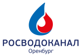

# RVK Quiz — Система тестирования сотрудников



---

## Описание

**RVK Quiz** — это система тестирования сотрудников, предназначенная для проведения, контроля и анализа знаний персонала в компании. Приложение реализует два основных сценария: прохождение теста сотрудником и управление результатами тестирования через административную панель.

---

## Сценарии использования и презентация работы

### Сценарии работы

1. **Сотрудник**:
   - Заходит на страницу теста, вводит уникальный номер, выбирает номинацию
     
   - Проходит тест с ограничением по времени
   - Получает краткую информацию о результатах и инструкцию
     
   - Подходит к администратору для подтверждения и заполнения ФИО/филиала

2. **Администратор**:
   - Авторизуется в административной панели
   - Просматривает статистику и аналитику по тестам, пользователям, филиалам
   - Управляет сущностями через CRUD-интерфейс (в разработке)
   - Присваивает ФИО и филиал пользователю после завершения теста

   

---

## Основной функционал

- **Точка входа** — страница входа на тест. Сотрудник вводит свой уникальный номер и выбирает номинацию (тест).
- После аутентификации пользователь перенаправляется на страницу прохождения теста.
- Вопросы формируются из пула по выбранной номинации, количество вопросов — настраиваемое.
- Для каждого теста действует ограничение по времени. Универсальный компонент таймера принимает необходимое время и колбэк завершения.
- После завершения теста отображается краткая информация о результатах, диаграмма и инструкция для сотрудника о необходимости подойти к администратору.
- После прохождения теста сотрудник подходит к администратору для подтверждения результатов и заполнения ФИО и филиала.
- В административной панели (доступ только после авторизации) реализованы:
  - Дэшборд со статистикой по тестам, пользователям, филиалам
  - CRUD для всех сущностей (пользователи, номинации, вопросы, ответы, филиалы) — в разработке
  - Присвоение ФИО и филиала пользователю после завершения теста
  - Защита панели через middleware

---

## Архитектура и технологии

- **Frontend:**
  - React 19 + TypeScript
  - Vite
  - Zustand (slice-архитектура, persist) — глобальное хранение состояний
  - TanStack Query (v5) — загрузка и мутация данных
  - TanStack Router — маршрутизация
  - CSS, стили находятся рядом с местом использования
  - Алиасы: `@` → `/src`

- **Backend:**
  - [rosvodokanal-quiz-rest-api (NestJS, TypeScript)](https://github.com/vitaly06/rosvodokanal-quiz-rest-api)

---

## Структура проекта

- `src/api/` — общие запросы TanStack Query
- `src/components/` — UI-компоненты (Badge, Button, Table, Timer и др.)
- `src/config/` — конфиги (instances)
- `src/modules/` — бизнес-модули (test-passing, test-starting, admin)
- `src/routes/` — file-based маршрутизация
- `src/store/` — глобальный store, slices по областям ответственности
- `src/types/` — общие типы (user, nomination, test, branch)
- `public/` — статика, логотипы, иконки, скриншоты

---

## Основные сущности

- **Пользователь (user):** проходит тестирование. Имеет уникальный номер, id, ФИО, филиал. ФИО и филиал заполняются администратором после завершения теста.
- **Администратор (admin):** наблюдает за процессом тестирования, управляет пользователями, тестами, аналитикой через защищённую панель.
- **Номинация (nomination):** сбор вопросов по определённой теме. Содержит банк вопросов и определённое количество случайных вопросов для одной сессии.
- **Вопрос (question):** содержит формулировку, несколько вариантов ответов, опционально — картинку.
- **Ответ (answer):** привязан к вопросу, имеет статус корректности (bool).
- **Филиал (branch):** определённый город или отделение компании, назначается пользователю администратором.

---

## Инструкция по запуску

### 1. Клонируйте репозиторий

```bash
git clone https://github.com/your-org/rvk-quiz.git
cd rvk-quiz
```

### 2. Установите зависимости

- **NPM:**
  ```bash
  npm install
  ```
- **Yarn:**

  ```bash
  yarn install
  ```

  - **Bun:**

  ```bash
  bun install
  ```

### 3. Запустите проект в режиме разработки

- **NPM:**
  ```bash
  npm run dev
  ```
- **Yarn:**

  ```bash
  yarn dev
  ```

  - **Bun:**

  ```bash
  bun dev
  ```

### 4. Сборка для продакшена

- **NPM:**
  ```bash
  npm run build
  ```
- **Yarn:**
  ```bash
  yarn build
  ```
- **Bun:**
  ```bash
  bun run build
  ```

---
